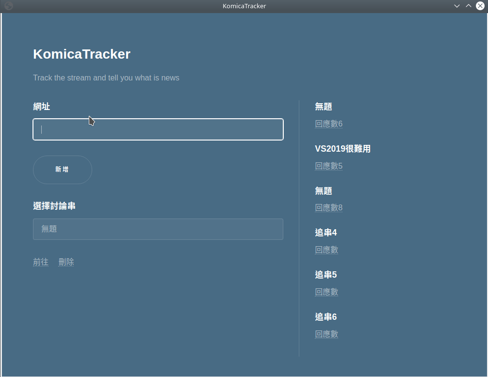
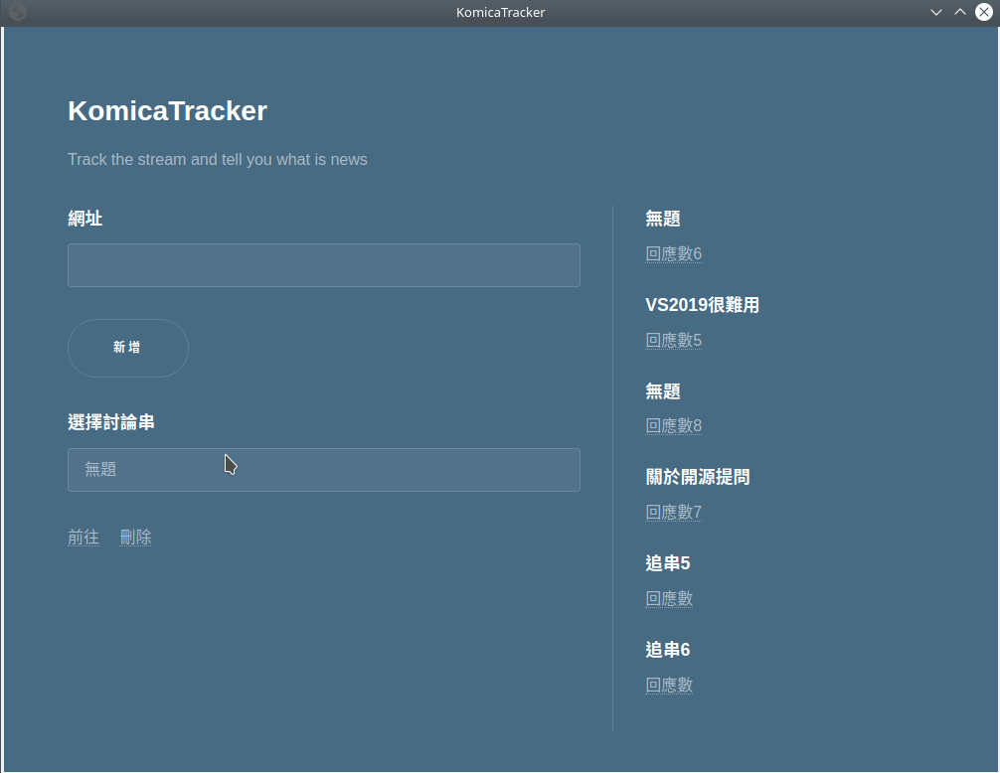

# KoTrack 

## From
- Use the golang package [lorca](https://github.com/zserge/lorca)
- UI(html) from [html5+](https://html5up.net)

## How to use 
- Add a stream

- Del a stream

## note
- 所有的資料都儲存於"./file/setting"內,有任何錯誤先刪掉後重新啟動程式
- 更新討論串回應數的動作只會發生在開啟程式的時候

# Version
## Unlease
- 若討論串沒有回覆則會抓不出標題
## [1.0.3] 2019-11-28
### ADD
- 新增了程設交流,詢問版面可以使用
### FIX
- 現在討論串被刪掉會回報了(測試中)
- 修復了有些版面標題不會被抓出的BUG
## [1.0.2] 2019-11-27
### ADD 
- 新增了歡樂惡搞,綜合學術討論,新番捏他,新番實況,綜合1,大綜二意志等版面
### CHANGE
- 更改license的位置,讓github會自動抓取
### FIX
- 修復了前往及刪除按鈕可能會有的BUG
## [1.0.1] 2019-11-25
### ADD 
- 新增了license
- 為README新增了example
### FIX
- 修復了更新回應數會有的計算錯誤
## [1.0.0] 2019-11-24
- 基本功能完成
- 資訊科學,影視版等 https://aqua.komica.org/ 網域的討論版可以使用